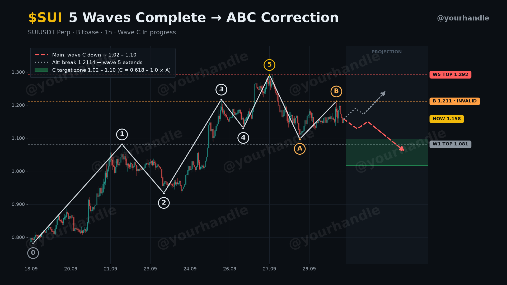
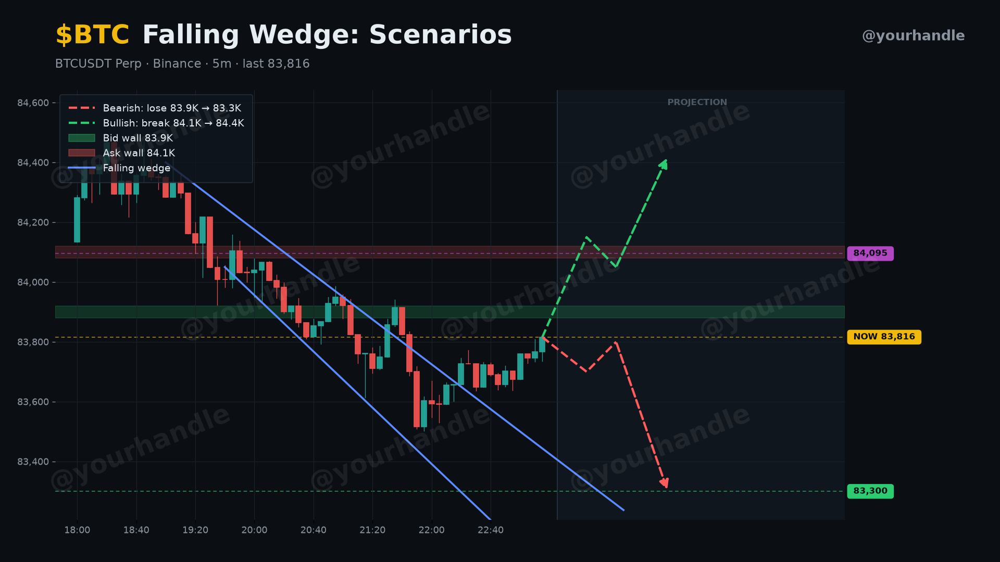

# Bitbase Chart Pro

**Unofficial** Claude plugin that turns real futures candles into clean, share-ready trading charts: support and resistance, trendlines and patterns, order-book walls, Elliott wave counts, scenario projections and a tiled watermark with your handle.

Not affiliated with or endorsed by Bitbase. Charts are analysis, not financial advice.




## What it does

- **Real data:** pulls candles from Bitbase's public futures API. If Cloudflare blocks the request, it falls back to Binance. A browser export gives exact Bitbase prices (see `skills/bitbase-chart/SKILL.md`).
- **Structure from data:** `swings.py` lists pivots, so levels, trendlines and wave counts come from the data instead of guesses.
- **Clean layout by design:**
  - price tags sit outside the plot, with a gold NOW tag
  - scenarios are listed in a legend
  - projections have their own shaded area
  - the title never collides with the ticker
- **Watermark:** your handle is tiled diagonally across the chart, so it cannot be cropped out.

## Usage

Install the plugin, then either ask Claude naturally ("chart SUI 1h with an Elliott count and my handle @me") or use the command:

```
/bitbase-chart-pro:chart SUIUSDT 1h @yourhandle elliott
/bitbase-chart-pro:chart BTCUSDT 5m @yourhandle
```

Requirements: `python3` with `matplotlib` (`pip install matplotlib`).

## Scripts (usable on their own)

```bash
S=skills/bitbase-chart/scripts
python3 $S/fetch.py SUIUSDT --interval 1h --limit 300 --out data.json
python3 $S/swings.py data.json --window 10
python3 $S/render.py examples/elliott-sui.json    # edit "data" to point at your data.json
```

Every config key is documented at the top of `render.py`. Two full examples are in `examples/`.

## License

MIT
